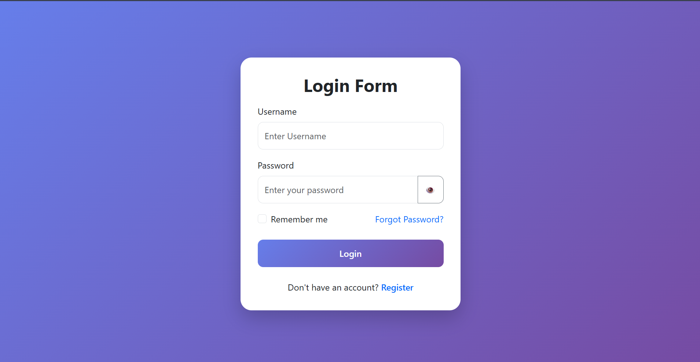
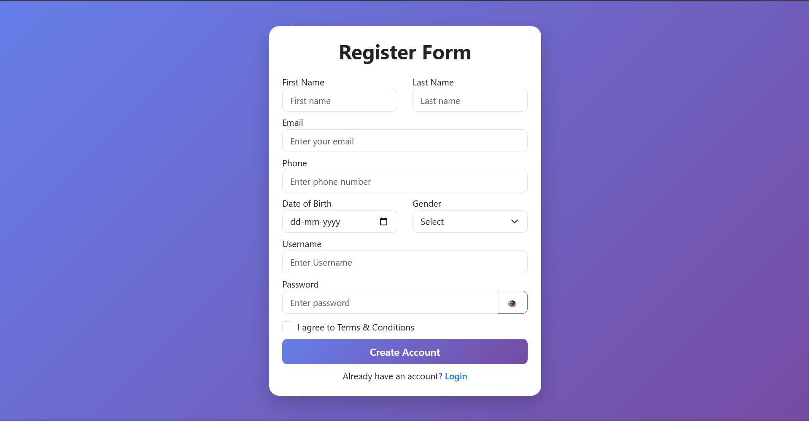
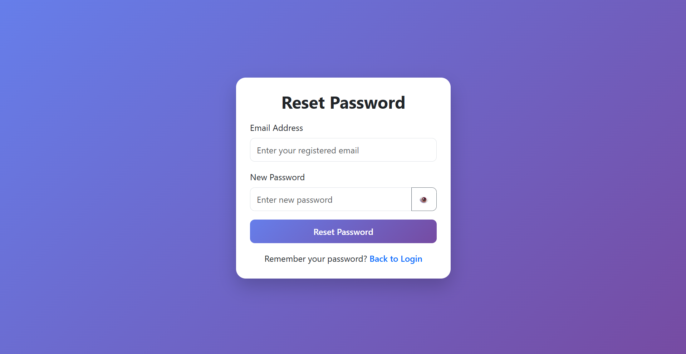
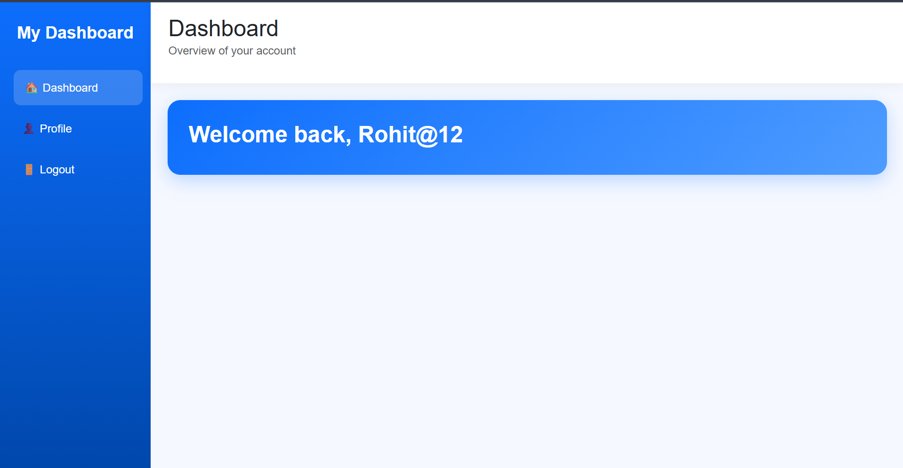
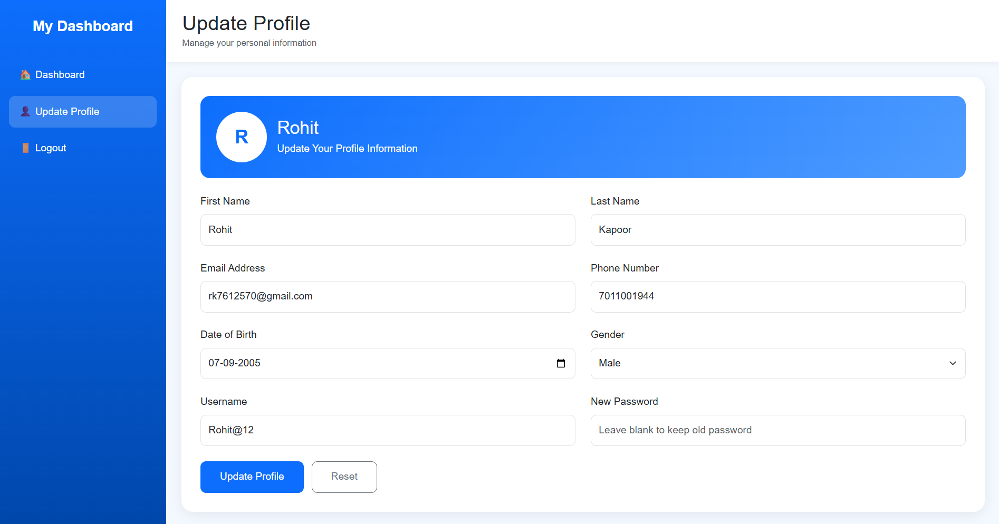
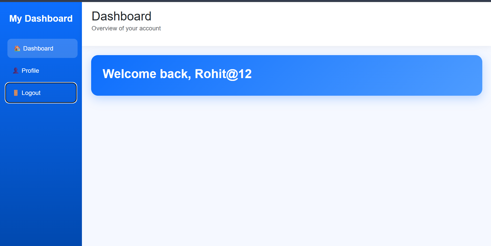

#  Login & User Dashboard System

A simple and responsive **PHP Login and User Dashboard System** built using PHP, MySQL, HTML, CSS, Bootstrap, and JavaScript.

This project is created to practice user authentication, database connectivity, password hashing, sessions, cookies, profile management, and basic CRUD operations.

## 🚀 Features

- ✅ User Registration
- ✅ User Login
- ✅ Password Hashing
- ✅ Password Verification
- ✅ Forgot Password
- ✅ PHP Session Authentication
- ✅ PHP Cookies
- ✅ Protected Dashboard
- ✅ User Profile Update
- ✅ Update Personal Information
- ✅ Change Password
- ✅ Logout
- ✅ Responsive UI
- ✅ Bootstrap 5
- ✅ MySQL Database Integration
- ✅ Show Logged-in User Information
- ✅ Show/Hide Password

---

## 🛠️ Technologies Used

- HTML5
- CSS3
- Bootstrap 5
- JavaScript
- PHP
- MySQL
- XAMPP

## 📂 Project Structure

PHP-Login-Authentication-System/
│
├── login.php
├── register.php
├── forget.php
├── update.php
├── dash.php
├── logout.php

<h1>Login Form </h1>

<h1>Register Form </h1>

<h1>Reset Password </h1>

<h1>Dashboard Page</h1>

<h1>Update Profile Page </h1>

<h1>Logout  </h1>

